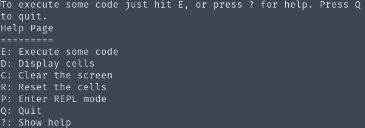
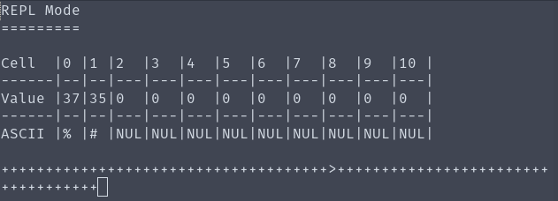

# BFI
A simple [Brainfuck](https://en.wikipedia.org/wiki/Brainfuck) interpreter and REPL written in perl.

## Installation
Clone the project then run `bf.pl`.
Once started enter a '?' to show the commands.
```
git clone https://github.com/danstewart/BFI.git
cd BFI/
./bf.pl
```


## Brainfuck Instructions
```
+ : increment current cell
- : decrement current cell
, : read STDIN into cell
. : print cell to STDOUT
> : shift to next cell
< : shift to previous cell
[ : jump to ']' if current cell is 0, else go to next command
] : jump back to '[' if current cell is greater than 0, else go to next command
```


## Screenshot


